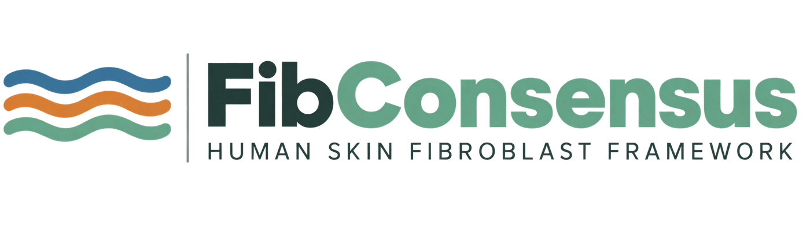

  

  <strong>Interactive exploration of the FibConsensus v2.2 evidence framework for human skin fibroblast annotation</strong>

  <a href="https://01a032e3-4d20-64d8-c899-d46a976377ff.share.connect.posit.cloud/">
    Launch FibConsensus Explorer
  </a>
  ·
  <a href="https://github.com/info4cure/FibConsensus">
    Scientific repository
  </a>
  ·
  <a href="https://doi.org/10.5281/zenodo.22181280">
    Zenodo archive
  </a>

---

## Overview

**FibConsensus Explorer** is the public, read-only interactive interface to the
**FibConsensus v2.2** scientific evidence resource.

FibConsensus reconstructs recurrent fibroblast identity across human skin
single-cell studies using an evidence- and provenance-aware framework. It
distinguishes recurrent cellular identity from hierarchical substructure,
partial biological correspondence and context-dependent state.

The frozen architecture resolves six recurrent fibroblast families while
retaining within-family specialization and a cross-family
mesenchymal/myofibroblast activation-state axis as distinct hierarchical
levels.

## What can be explored?

The Explorer provides interactive access to:

- 51 systematic-review studies
- 334 author-reported fibroblast populations
- 73 adjudicated cross-study relationships
- 6 recurrent consensus fibroblast families
- recurrent marker evidence
- evidence provenance and dataset reuse
- consensus-family architecture
- atlas-based validation
- cross-dataset reproducibility
- disease-associated remodelling
- downloadable validated tables

## FibConsensus architecture

The six recurrent consensus families are:

1. **Papillary/superficial fibroblasts**
2. **Reticular/SFRP2-DPP4 fibroblasts**
3. **COL11A1/DPEP1 dermal-sheath-like fibroblasts**
4. **Hair-follicle dermal papilla fibroblasts**
5. **PI16-associated perivascular/adipogenic fibroblasts**
6. **APOE-associated immune/perivascular fibroblasts**

The **CCL19/CD74 immune-supportive programme** is retained as within-family
substructure of the APOE-associated immune/perivascular family, whereas the
**mesenchymal/myofibroblast programme** is represented as a cross-family
activation-state axis rather than an additional identity family.

## Versioning

| Component | Version |
|---|---|
| Scientific evidence resource | **FibConsensus v2.2** |
| Interactive application | **FibConsensus Explorer v1.0.0** |
| Deployment mode | Read-only |
| Scientific archive | Zenodo |

The Explorer does not modify source records, perform biological adjudication,
or re-estimate family, subtype or state-axis assignments. Downloads are
generated from validated read-only database views associated with the frozen
FibConsensus v2.2 scientific release.

## Live application

**FibConsensus Explorer**

https://01a032e3-4d20-64d8-c899-d46a976377ff.share.connect.posit.cloud/

## Reproducibility

Application source code and deployment resources are versioned in this
repository. The manuscript-associated application environment is also
available as a validated containerized deployment.

The scientific evidence resource, frozen projection signatures, robustness and
sensitivity outputs, atlas-validation results, disease-remodelling results,
figure source data and provenance files are archived separately in the
FibConsensus v2.2 scientific release.

### Scientific repository

https://github.com/info4cure/FibConsensus

### Permanent archive

https://doi.org/10.5281/zenodo.22181280

## Citation

Gay-Mimbrera J, Dávila-Flores V, Rivera-Ruiz I, Sanz-Cabanillas JL,
Gómez-García F, Hu BD, He H, López-Viñau T, Isla-Tejera B,
Guttman-Yassky E, Ruano J.

**An evidence-based framework resolves fibroblast identity across human skin
single-cell studies and an integrated atlas.**

Manuscript-associated resource, 2026.

## License

See [LICENSE](LICENSE) for repository licensing information.
